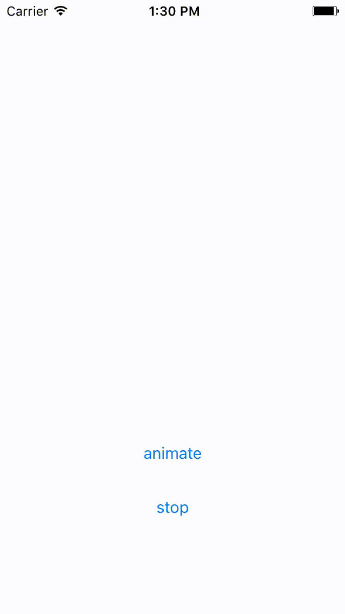

# YKUpDownIndicator 


[](LICENSE)
[](https://github.com/Carthage/Carthage)

**YKUpDownIndicator** is simple loading indicator that can easily use anywhere, such as interacting with internal server, processing something cool!



## Requirements

* iOS 8.0 +
* Swift 3.0 +
* Xcode 8.0 +

## Installation

### Cocoapods
```
pod 'YKUpDownIndicator'
```

### Carthage
```
github "yojkim/YKUpDownIndicator"
```

## Usage

```Swift
// You can make Indicator size you want!
let upDownIndicator = YKUpDownIndicator(frame: CGRect(x: 0, y: 0, width: 100, height: 100))

// You can work with Storyboard!
@IBOutlet var upDownIndicator: YKUpDownIndicator!
```

## Animation
```Swift
upDownIndicator.animate()
upDownIndicator.stop()
```

## LISENCE

YKUpDownIndicator is available under the MIT license. See the LICENSE file for more info.

## Author 

Yong Jae Kim - [yojkim](http://github.com/yojkim)


